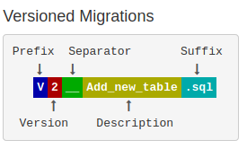

# 版本化数据库

## 如何理解Flyway
Flyway进行版本化的逻辑非常简单。
1. 在目标数据库中创建一个`flyway_schema_history`的表，用于记录数据库当前的版本。
2. 当执行`flyway migrate`执行，根据config/flyway.conf配置中的连接信息连接到数据库。
3. 检查`sql`目录的sql文件。sql文件名遵从flyway的命名约定。如果`sql`目录的版本比实际数据库中`flyway_schema_history`表里记录的版本要低，则执行升级版本的sql文件。
4. 如果执行升级sql文件成功，则更新`flyway_schema_history`表中记录。

以上是个人理解flyway原理后，用大白话阐述出来的。大家可以看下官方介绍：https://flywaydb.org/getstarted/how

## sql文件的命名约定



## 执行样例
在安装完成flyway命令（[下载地址](https://flywaydb.org/documentation/commandline/)）后，执行命令：
```shell
flyway -configFiles=config/flyway.conf migrate
```

执行结果：
```build
Flyway Community Edition 6.5.5 by Redgate
Database: jdbc:h2:file:./foobardb (H2 1.4)
Successfully validated 0 migrations (execution time 00:00.009s)
WARNING: No migrations found. Are your locations set up correctly?
Creating Schema History table "PUBLIC"."flyway_schema_history" ...
Current version of schema "PUBLIC": << Empty Schema >>
Schema "PUBLIC" is up to date. No migration necessary.
```

## 与CI/CD集成
当Git仓库准备好后，我们就需要和类似Jenkins这样的CI/CD集成了。集成的思路很简单，就是把本地执行的命令照搬到CI/CD平台上就行。思路：
1. 准备Flyway的执行环境。推荐在Docker容器中运行。
2. 执行flyway命令。

## 安全问题
flyway.conf文件会有数据库的连接信息，这是敏感信息。我们不应该直接放在Git仓库中。那怎么办？

笔者的办法是config目录中只放flyway.conf的模板文件，比如`config/flyway.template.conf`，在CI/CD中执行flyway migrate执行前，
通过比较安全的方式将flyway.template.conf中的占位符换成真正值。


END 全文完

作者：翟志军 个人公众号：老翟杂谈  个人博客：https://showme.codes

